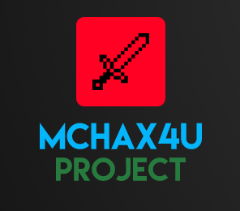

# MCHAX4U CLIENT TOOL
> [PS4 JB Minecraft Bedrock how to Bypass Sign in for playing online](https://www.psxhax.com/threads/minecraft-v1-18-1-ps4-pkg-to-bypass-psn-play-on-minecraft-servers.12849/)
-------------------------------------------------------------
A Tool made on C# tool using update patch of PS4 2.35v
otherwise Minecraft update 1.18.1v
--------

## Also useful

- [PS4 Cheater & ps4debug](https://github.com/ctn123/PS4_Cheater) - PS4 Cheater is a homebrew application to find game cheat codes. It is based on ps4debug.
- [PS4 Save Mounter](https://github.com/ctn123/Binary-Releases) - PS4 Cheater is a homebrew application to find game cheat codes. It is based on ps4debug.

## License

